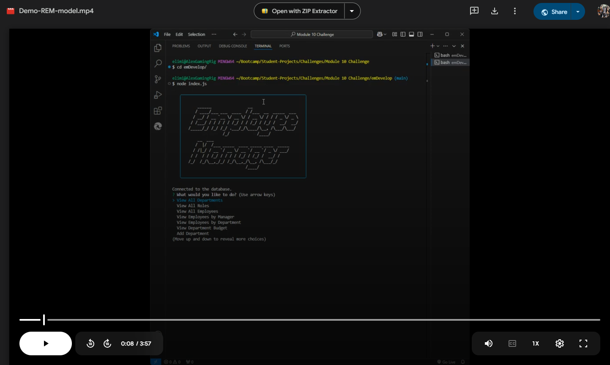

# Employee Tracker

## Description
This is a command-line application designed to help businesses efficiently manage their employees, roles, and departments using a PostgreSQL database. Users can view, add, update, and delete organizational data interactively via an intuitive CLI interface.

## Features
- **View All Data**: List departments, roles, and employees in a structured format.
- **Add Data**: Add new departments, roles, and employees to the database.
- **Update Data**: Modify employee roles and managers.
- **Delete Data**: Remove departments, roles, or employees.
- **View by Manager or Department**: Organize employees by their manager or department.
- **Calculate Department Budgets**: View the total salaries of all employees in a specific department.

## Installation

Follow these steps to set up the project:

1. Clone the repository:
   ```bash
   git clone https://github.com/your-repo-url.git
   ```
2. Navigate to the project directory:
   ```bash
   cd [The directory of the package.json]
   ```
3. Install dependencies:
   ```bash
   npm install
   ```
4. Create a `.env` file in the root directory and add the following:
   ```env
   DB_USER=yourDatabaseUser
   DB_PASSWORD=yourDatabasePassword
   DB_HOST=localhost
   DB_PORT=5432
   DB_DATABASE=yourDatabaseName
   ```
    - Create the PostgreSQL database:
    ```bash
    psql -U postgres
    CREATE DATABASE [yourDatabaseName];
    ```
    - Verify PostgreSQL Database is connected by connecting to it:
    ```bash
    \c [yourDatabaseName]
    ```
    - Return to terminal:
    ```bash
    \q
    ```
5. Set up the database:
   - Run the `schema.sql` file to create the database structure:
     ```bash
     psql -U postgres -d employee_tracker -f ./db/schema.sql
     ```
   - Seed the database with sample data:
     ```bash
     psql -U postgres -d employee_tracker -f ./db/seeds.sql
     ```
6. Start the application:
   ```bash
   node index.js
   ```

## Usage
Once the application is running, you can:

- **View All Data**: Select options to view departments, roles, or employees in a tabular format.
- **Add Data**: Follow prompts to add new departments, roles, or employees.
- **Update Data**: Select an employee to update their role or manager.
- **Delete Data**: Choose to delete a department, role, or employee.
- **Advanced Features**: View employees by manager or department, or calculate department budgets.

### Example Interaction
```bash
? What would you like to do? View All Employees
id  first_name  last_name  title                 department       salary  manager_id
--  ----------  ---------  --------------------  ---------------  ------  ----------
1   John        Doe        Software Engineer     Engineering      90000   null
2   Jane        Smith      Accountant            Finance          70000   null
```

## Walkthrough Video

[Click here to watch the Demo video](https://drive.google.com/file/d/1xFQ1ed0iR4VBlisT1GZTdDUBehoVtMf7/view?usp=sharing)

This video demonstrates how to:
- Start the application.
- Use each feature, including bonus features.
- Ensure the application satisfies all criteria.

## Technologies Used
- **Node.js**: Backend JavaScript runtime.
- **PostgreSQL**: Relational database management system.
- **Inquirer**: CLI prompts for user interaction.
- **console.table**: Tabular output for CLI data display.
- **figlet & boxen**: ASCII art and CLI styling.
- **dotenv**: Secure environment variable management.

## Database Schema
The database contains the following tables:

### **department**
| Column | Type         | Constraints              |
|--------|--------------|--------------------------|
| id     | SERIAL       | PRIMARY KEY              |
| name   | VARCHAR(30)  | UNIQUE, NOT NULL         |

### **role**
| Column         | Type         | Constraints              |
|----------------|--------------|--------------------------|
| id             | SERIAL       | PRIMARY KEY              |
| title          | VARCHAR(30)  | UNIQUE, NOT NULL         |
| salary         | DECIMAL      | NOT NULL                 |
| department_id  | INTEGER      | FOREIGN KEY -> department|

### **employee**
| Column         | Type         | Constraints              |
|----------------|--------------|--------------------------|
| id             | SERIAL       | PRIMARY KEY              |
| first_name     | VARCHAR(30)  | NOT NULL                 |
| last_name      | VARCHAR(30)  | NOT NULL                 |
| role_id        | INTEGER      | FOREIGN KEY -> role      |
| manager_id     | INTEGER      | FOREIGN KEY -> employee  |

## Future Enhancements
- Add search functionality.
- Add capabilities to store/archive old data for audits
   - Boost storage performance for larger databases
- Create a GUI for easier interaction.
- Implement advanced reporting and analytics.

## Credits
- Developed by: Alex Marrero
    - GitHub: [Amarrero0215](https://github.com/Amarrero0215)
- [Inquirer Documentation](https://www.npmjs.com/package/inquirer)
- [PostgreSQL Documentation](https://www.postgresql.org/docs/)

## License
MIT License

